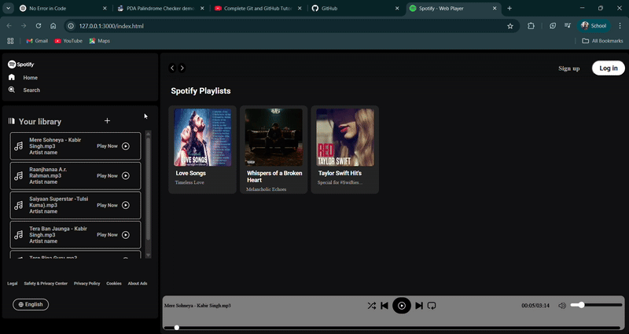

<h1 align="center">🎵 Spotify Clone 🎧</h1>

<p align="center">
  A fully functional and dynamic Spotify-like music streaming web app built with HTML, CSS, JavaScript, and Audio APIs.  
  <br><br>
  
</p>

---

## 🚀 Features

✅ Modern Spotify UI layout  
✅ Dynamic song loading via API  
✅ Real-time music player controls  
✅ Play/Pause, Volume, Seek, Next/Previous  
✅ Responsive design (mobile-friendly)  
✅ Custom playlists (Love Songs, Taylor Swift Hits, etc.)

---

## 🛠️ Tech Stack

| Tech         | Description                         |
|--------------|-------------------------------------|
| HTML5        | Markup and structure                |
| CSS3         | Styling and responsive layout       |
| JavaScript   | Dynamic logic and audio handling    |
| Web Audio API| Streaming and controlling music     |
| JSON         | Song metadata for dynamic loading   |

---

## 📁 Folder Structure

```bash
📦spotify-clone/
 ┣ 📂assets/
 ┃ ┣ 📂images/           # Album arts
 ┃ ┗ 📂music/            # Audio files
 ┣ 📂api/
 ┃ ┗ songs.json          # Song data
 ┣ 📄 index.html
 ┣ 📄 style.css
 ┣ 📄 script.js
 ┗ 📄 README.md
